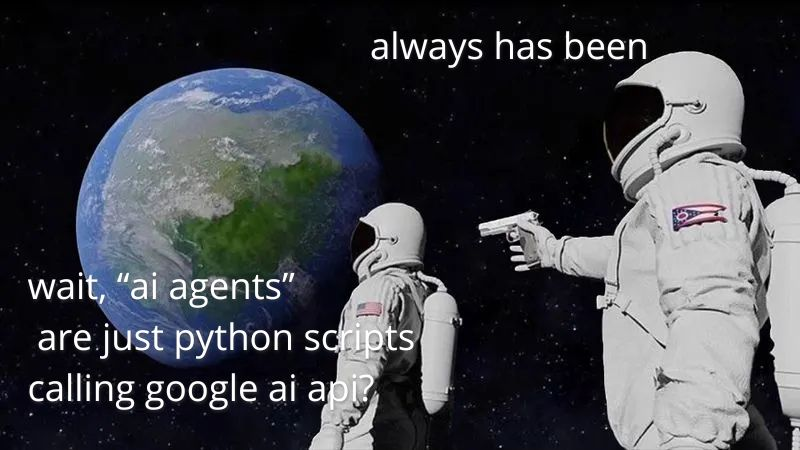

# soy-agent

## About

Soy-agent is a code ai agent capable of exploring and modifing files in specified working directories.

### Features

- Listing files and directories along with their metadata inside desired directory,
- Exploring contents of files,
- Writting to specified files,
- Calling pre-defined functions.

### Technologies

- Google's Gemini using [Google AI Studio](https://aistudio.google.com) API.
- Python

<p align="center">

</p>

## Usage

### Requirements

- Python 3.10+
- [uv](https://github.com/astral-sh/uv)

### Prerequisite

You need to create `.env` file in the root directory 
containing your [Google AI Studio](https://aistudio.google.com) API key.
It should look something like this:
```
# .env
GEMINI_API_KEY="<your_api_key_here>"
```

### Run

Create virtual environment `venv`:
```
uv venv
source .venv/bin/activate
```

Install dependencies from `uv.lock`:
```
uv pip install -r uv.lock
```

**Run** the project:
```
uv run main.py "Hello there"
```

Replace `"Hello there"` with your own prompt.
You can add addidtional flag `--verbose` to see what's going on under the hood.

### Info

Agent is **limited** to specified working directory (see `./config.py` -> `WORKING_DIR`)
for safety reasons. Default is set to `./calculator`.

---

Made as a project in [boot.dev](https://www.boot.dev) course.
